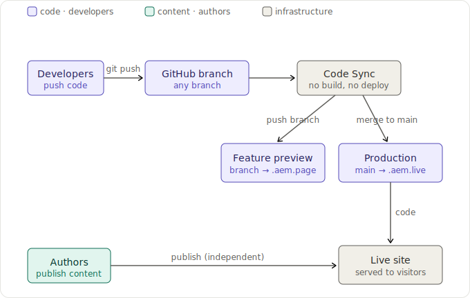

# Author Kit
For projects that want a few more batteries. Built by the team who brought you da.live and adobe.com.

## Getting started

### 1. Github
1. Use this template to make a new repo.
1. Install [AEM Code Sync](https://da.live/bot).

### 2. DA content
1. Browse to https://da.live/start.
2. Follow the steps.

### 3. Local development
1. Clone your new repo to your computer.
1. Install the AEM CLI using your terminal: `sudo npm install -g @adobe/aem-cli`
1. Start the AEM CLI: `aem up`.
1. Open the `{repo}` folder in your favorite code editor and buil something.
1. **Recommended:** Install common npm packages like linting and testing: `npm i`.

## Deployment (CI/CD)

Edge Delivery Services has no build step and no deploy step. AEM Code Sync watches the GitHub repo and serves code directly from branches.

- Pushing to a branch deploys to that branch's preview environment.
- Merging to `main` deploys to production.
- Content and code deploy independently: authors publish content, developers push code.



### Environments

| Environment | URL | Updated by |
|---|---|---|
| Local | `http://localhost:3000` (`aem up`) | Your local code, with content proxied from the preview environment (`.aem.page`) |
| Feature preview | `https://{branch}--kp-hw--AdobeDrago.aem.page/` | Push to that branch |
| Production preview | `https://main--kp-hw--AdobeDrago.aem.page/` | Merge to `main` |
| Production live | `https://main--kp-hw--AdobeDrago.aem.live/` | Author publish in DA |

Content is authored in Document Authoring: https://da.live/#/AdobeDrago/kp-hw

### Daily workflow

1. **Branch** — create a slash-free branch name (slashes break the preview URL hostname).
2. **Develop** — run `aem up` and iterate against `http://localhost:3000`.
3. **Lint** — run `npm run lint` before pushing (auto-fix with `npx eslint . --fix` and `npx stylelint --fix`). No pre-commit hook enforces this, so it's on you.
4. **Test** — run `npm test` if you touched block logic or utilities.
5. **Push** — AEM Code Sync auto-publishes your branch to its feature preview.
6. **Open a PR** to `main` and include a feature-preview link to a page that demonstrates the change.
7. **Verify checks** with `gh pr checks`, then request review.

### PR gates

- **AEM Code Sync** — confirms the branch published cleanly; this status must be green.
- **PageSpeed Insights** — run against the feature preview URL and aim for a score of 100.
- **Lint** — `npm run lint` must pass. Run it locally; it is not enforced by a git hook.

### Linting

`npm run lint` runs two linters in sequence — run either on its own while iterating:

- `npm run lint:js` — ESLint over the whole repo, using [`@adobe/eslint-config-helix`](https://github.com/adobe/helix-eslint-config) (Airbnb-based). Config: [`eslint.config.js`](eslint.config.js).
- `npm run lint:css` — Stylelint over `blocks/**/*.css` and `styles/*.css`, using `stylelint-config-standard`. Config: [`.stylelintrc.json`](.stylelintrc.json).

There is no `lint:fix` script — auto-fix with the linters directly:

```sh
npx eslint . --fix
npx stylelint "blocks/**/*.css" "styles/*.css" --fix
```

Notes:
- `deps/` and the Storybook build output (`tools/storybook/dist`, `tools/storybook/storybook-static`) are ignored by ESLint; `blocks/header/header.css` and `header.overrides.css` are ignored by Stylelint (see `.stylelintignore`).
- No pre-commit hook runs lint, so run it yourself before pushing. A failing lint will not block Code Sync from publishing your branch, but reviewers will expect it green.

### Performance (PageSpeed Insights)

Edge Delivery ships fast by default, so the goal is to avoid regressing it. Target a PSI score of 100 across all four categories (Performance, Accessibility, Best Practices, SEO).

1. Push your branch so it publishes to its feature preview.
2. Run PSI against the preview URL: `https://pagespeed.web.dev/analysis?url={feature-preview-url}` — test the **mobile** tab, which is the stricter score.
3. Fix regressions before opening the PR.

Most regressions come from a small set of causes:
- Unoptimized committed assets — pre-optimize anything in `img/`, `icons/`, `fonts/`. Author-uploaded images are optimized automatically; committed ones are not.
- Render-blocking or oversized JavaScript loaded eagerly — defer non-critical work to `scripts/delayed.js`.
- Layout shift (CLS) from images without dimensions or late-loading fonts.
- CSS that isn't needed for LCP loaded in `styles/styles.css` instead of `styles/lazy-styles.css`.

See [Keeping it 100](https://www.aem.live/developer/keeping-it-100) for the full performance guide.

### Gotchas

- The feature preview needs a push — uncommitted local code is only visible at `localhost:3000`.
- Never modify `scripts/aem.js`.
- Committed assets (images, fonts, icons) must be pre-optimized — nothing optimizes them for you, unlike author-uploaded images.
- Production content goes live only when an author publishes in DA, not when code merges to `main`.

## Features

### Localization & globalization
* Language only support - Ex: en, de, hi, ja
* Region only support - Ex: en-us, en-ca, de-de, de-ch
* Hybrid support - Ex: en, en-us, de, de-ch, de-at
* Fragment-based localized 404s
* Localized Header & Footer
* Do not translate support (#_dnt)

### Flexible section authoring
* Optional containers to constrain content
* Grids: 1-6
* Columns: 1-12
* Color scheme: light, dark
* Gap: xs, s, m, l, xl, xxl
* Spacing: xs, s, m, l, xl, xxl
* Background: token / image / color / gradient

### Base content
* Universal buttons w/ extensive styles
* Images w/ retina breakpoint
* Color scheme support: light, dark
* Modern favicon support
* New window support
* Deep link support
* Modal support

### Header and footer content
* Brand - First link in header
* Main Menu - First list in header
* Actions - Last section of header
* Menu & mega menu support
* Disable header/footer via meta props

### Scheduled content
* Schedule content using spreadsheets

### Sidekick & pre-production
* Quick Edit
* Extensible plumbing for plugins
* Schedule simulator
* Convert production links to relative

### Performance
* Extensible LCP detection

### Developer tools
* Environment detection
* Extensible logging (console, coralogix, splunk, etc.)
* Buildless reactive framework support (Lit)
* Hash utils patterns (#_blank, #_dnt, etc)
* Modern CSS scoping & nesting
* AEM Operational Telemetry

### Operations
* Cloudflare Worker reference implementation

## Patterns
### Page
A page is what holds your content. It can be styled using a metadata property called `template` which will load styles that apply to the entire page.

### Section
A section is a sub-section of your page. It can be styled using a `section-metadata` block. A section will control the layout of blocks.

### Block
Blocks are children of sections. A block adds visual context to parts of a page.

### Auto Block
An auto block is a block generated from a pre-defined piece of content. Often times from a link that matches a particular pattern. Link-based auto blocks can be helpful when additional nesting of content is required.

### Default content
Default content is content that lives outside a block.

## Design System

### Spacing & Gap
XS, S, M, L, XL, XXL

### Emphasis
quiet, default, strong, negative

### Buttons
accent, primary, secondary, negative
(w/ outline variations)

### Columns
1 - 12

### Grid
1 - 6

### Color tokens
blue, gray, green, magenta, organge, red, purple, yellow
(w/ 100-900 variations)

### Color schemes
light, dark

## KP Lucid Search (`utils/lucid-search.js`)

Shared library for blocks that query the KP Lucid Search API. Handles URL construction, region mapping, and the CORS proxy — blocks import what they need and focus on UI.

### Why a proxy?

The KP Lucid Search API (`apims.kaiserpermanente.org`) does not return CORS headers, so browser `fetch()` calls are blocked. Requests route through an Adobe App Builder action (`kp-search`) that calls KP server-side and returns the response with CORS headers. The browser only ever talks to the proxy.

### Exports

| Export | Type | Description |
|---|---|---|
| `PROXY_ENDPOINT` | `string` | App Builder proxy URL (stage) |
| `KP_SEARCH_BASE` | `string` | KP Lucid Search API base URL |
| `DEFAULT_ROP` | `string` | Default region of practice (`'SCA'`) |
| `DEFAULT_DISTANCE` | `number` | Default search radius in miles (`50`) |
| `zipToRop(zip)` | `function` | Maps a 5-digit CA ZIP to `'NCA'` or `'SCA'` |
| `latToRop(lat)` | `function` | Maps a latitude to `'NCA'` or `'SCA'` |
| `buildKpSearchUrl(opts)` | `function` | Builds the full KP search URL from search options |
| `callProxy(kpUrl)` | `function` | POSTs `{ url, method }` to the proxy and returns parsed JSON |
| `fetchTopics(opts)` | `function` | Returns `[{ label, token, count }]` — topic facets, no results |
| `fetchResults(opts)` | `function` | Returns paginated results + facets + navigation |

### Usage

```js
import {
  DEFAULT_ROP, DEFAULT_DISTANCE,
  zipToRop, latToRop,
  fetchTopics, fetchResults,
} from '../../utils/lucid-search.js';
```

#### Populate a topic dropdown from a ZIP code

```js
const rop = zipToRop('94105');           // 'NCA'
const topics = await fetchTopics({ rop, zip: '94105' });
// topics: [{ label: 'Diabetes', token: 'health_topic==Diabetes', count: 51 }, ...]
```

#### Fetch a page of results with filters

```js
const data = await fetchResults({
  rop: 'NCA',
  zip: '94105',
  miles: 25,
  topicLabel: 'Diabetes',
  offset: 0,                             // page 1; increment by 10 for "load more"
  filterTokens: ['facility==Oakland Medical Center'],
});
// data.list.document — result records
// data.binning['binning-set'] — facet groups for sidebar filters
// data.list.num — total result count
```

#### `buildKpSearchUrl` options

| Option | Default | Description |
|---|---|---|
| `rop` | — | Region of practice (`'NCA'` / `'SCA'`) — required |
| `zip` | `''` | 5-digit ZIP code |
| `lat` / `lon` | `''` | Coordinates (used when ZIP unavailable) |
| `miles` | `DEFAULT_DISTANCE` | Search radius |
| `topicLabel` | `''` | Health topic label (e.g. `'Diabetes'`) |
| `listShow` | `0` | `0` = facets only; `10` = results + facets + navigation |
| `vstate` | `''` | Pagination window, e.g. `'root\|root-10-10'` |
| `filterTokens` | `[]` | Active sidebar filter tokens — one entry per active filter |

#### Proxy transport

`callProxy` sends a `POST` request to `PROXY_ENDPOINT` with a JSON body:

```json
{ "url": "<full-kp-search-url>" }
```
